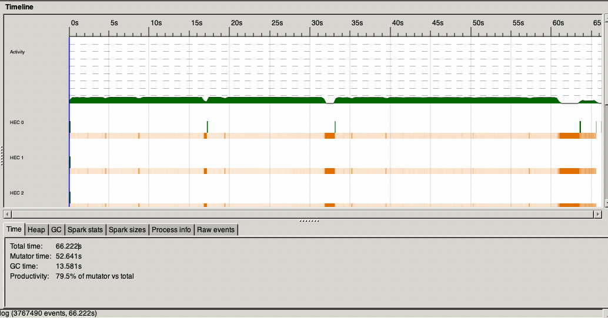
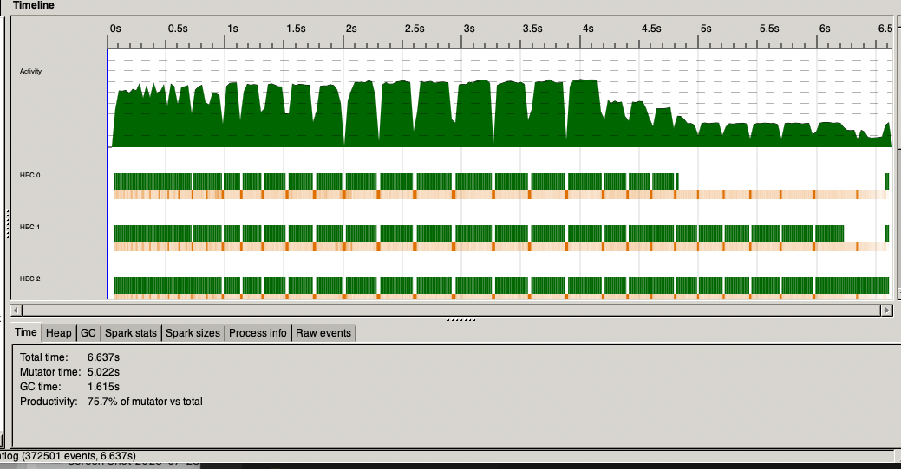

# Trader Contagion
## Overview
In this project, I implemented a parallel version of the agent based and stochastic
model described in "Linking agent-based models and stochastic models of financial
markets". The paper focuses on linking agent-based and stochastic models to under-
stand financial market dynamics. The paper investigates the emergence of fat tails
and long-term memory in financial returns, suggesting that these characteristics can
be attributed to the collective behavior of market participants. It emphasizes the im-
portance of agent heterogeneity and the interaction between different types of traders.
The research demonstrates how agent-based models can provide valuable insights
into complex market phenomena and supports the idea that market dynamics are
deeply rooted in the actions and strategies of individual traders.

## Implementation
The agent based model simulates the actions of individual agents in a financial market,
incorporating randomness(noise) to reflect real-world unpredictability.
The model calculates the probability of trading based on market velocity (V), differ-
entiating between fundamental (Vf ) and technical traders (Vc). Fundamental traders
are assumed to hold a majority of the shares 83%, basedonhistoricaldata f rom1997 −
2006. Trading probability is derived from the velocities, with multiple choices for Vf ,
including the best-fit value of 0.4 used in the paper.

Agents decide whether to buy, sell, or hold based on the calculated trading prob-
ability. They are also distributed into opinion groups, with the number of groups
determined by ω. The model sets a logical minimum of one opinion group (where all
agents share the same opinion) and a maximum equal to the number of agents. The
diversity of opinions affects market dynamics, with a higher number of groups reduc-
ing herd behavior. At each timestep, the model updates based on agents’ decisions and market changes. This includes recalculating trading probabilities and adjusting
agent behaviors according to new market conditions. The boundaries on returns is set
according to the guidelines from Feng et al. 2012’s Appendix 5.

In my implementation, I mainly focused on testing sensitivity of the model return’s
on the number of opinion groups to []. I simulated 10 runs for each ω (11 different ω
values) listed on the paper. In each run, I used the following parameters:
· number of agents (n) : 1024
· probability of trading (p) : 0.2178
· steps: 1000

For each value of ω, I collected key statistics: daily returns, daily trading volume,
total trading volume. Based on the paper, I implemented hill estimator and linear
regression model to understand the relationship between the returns and number of
opinion group.

Hill estimator is used in the paper to primarily to assess the tail heaviness of a dis-
tribution. The Hill estimator provides a measure of the "tail thickness" of the distri-
bution, with higher values indicating a "heavier" tail, which implies a higher risk of
extreme price movements. Hill estimators are used in financial modeling to evaluate
the risk of extreme price movements. I implemented linear regression to to model
the relationship between the omega parameter (representing the number of opinion
groups) and the Hill estimator values of returns (representing market extremities) de-
rived from market simulations. The linear regression model is fitted to these values
and calculates and returns the slope, intercept, the coefficient of determination (R2),
and p-value, which indicate how much of the variability in the Hill estimator can be
explained by omega.

After the simulations and analysis, the calculated p-value (0.00037123621) is less than
0.05 rejecting the null hypothesis and showing a significant relationship between the
variables. A positive correlation is also observed between omega and the Hill expo-
nent as shown in the paper. Higher omega values which means higher number of
opinion groups therefore decreased probability of herd effect correlate with a steeper
slope of the distribution. For instance, if all market participants converge into a sin-
gle opinion group and consequently execute identical trading actions, it would lead to
high fluctuation in return, reflecting extreme market movements

I also implemented the stochastic model detailed on the paper. It involved allocating
agents across different time horizons, informed by their trading strategies and market
behaviors. This model captures the randomness inherent in financial markets. Agents are distributed based on an exponential decay function, which accounts for the diminishing influence of past market events over time.

## Parallel Implementation
I parallelized the simulations and analysis related to different omega values described
in the section above. The sequential version took over 60s, I was able to get to around
6s in the parallel version.

Here are the threadscope results:

*Figure 1: Sequential Simulation*

*Figure 2: Parallel Simulation*

## References 
1. Feng, L., Li, B., Podobnik, B., Preis, T., Stanley, H. E. (2012). Linking agent-
based models and stochastic models of financial markets. Proceedings of the National Academy of Sciences of the United States of America, 109(22), 8388–8393.
http://www.jstor.org/stable/41602564

2. Hill, B.M. (1975) A simple general approach to inference about the tail of a distribution. Annals of Statistics. 13, 331-3414
